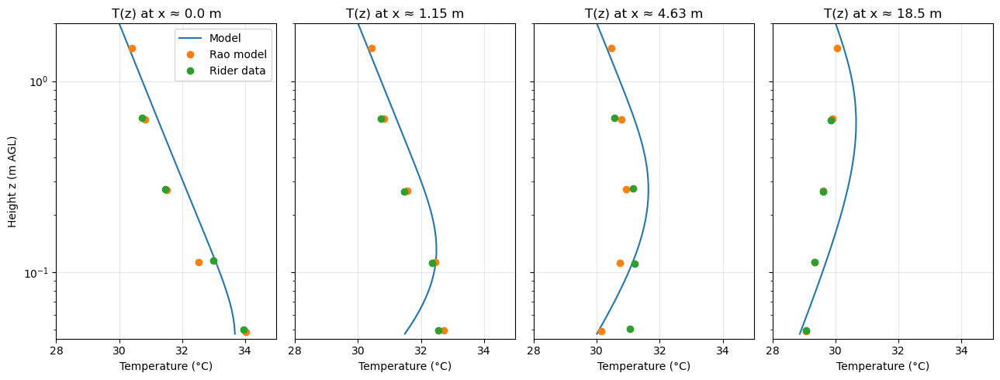

# Sutton's Advection Problem

A Python implementation of the 2-D boundary-layer advection model originally described by Sutton (1953) and applied by Rao et al. (1974) and Baldocchi & Rao (1995). The model solves for the redistribution of heat and water vapour downwind of an abrupt surface discontinuity — for example, where an irrigated crop field borders dry fallow land.



*Modelled temperature profiles (blue lines) compared with Rao's (1974) analytical solution (orange) and Rider's field measurements (green) at four downwind distances.*

## Background

When air flows from a hot, dry surface onto a cooler, wetter surface, the abrupt change in boundary conditions generates **local advection** of sensible and latent heat. This advective enhancement can substantially increase evapotranspiration rates on the downwind patch — an effect especially important in fragmented agricultural landscapes such as California's Central Valley.

This codebase:

- Re-implements the original FORTRAN (`CLOSET.FOR`) and MATLAB reference solutions in Python.
- Uses an implicit finite-difference scheme with the Thomas algorithm (tridiagonal solver) to march the advection–diffusion equations downstream in *x*.
- Employs mixing-length eddy diffusivity with configurable options (`kz`, canopy-based).
- Reproduces the temperature and humidity profiles from Rao et al. (1974, Figures 1 & 2) and surface fluxes from Baldocchi & Rao (1995).

## Installation

Requires Python ≥ 3.10.

```bash
git clone https://github.com/octavia-crompton/suttons-problem.git
cd suttons-problem
pip install -e ".[dev]"
```

## Quick start

```python
from sutton import (
    Params,
    integrate_T_implicit,
    integrate_H2O_implicit,
    thomas,
    our_central_difference,
    saturation_vapor_pressure,
)

# Create a parameter set (all defaults match Rao 1974 base case)
p = Params(ustar_f=0.14, ustar_c=0.14, Hmax=2, dz=0.005, dx=0.2)
```

See the notebooks in `notebooks/` for full worked examples, including profile comparisons with digitized data from Rao (1974) and Baldocchi (1995).

## Project structure

```
suttons_problem/
├── src/sutton/              # Core Python package
│   ├── config.py            # Params dataclass
│   ├── integrators.py       # integrate_T_implicit, integrate_H2O_implicit
│   ├── numerics.py          # Thomas algorithm, central differences
│   ├── physics.py           # Saturation vapour pressure, vapour concentration
│   ├── stability.py         # Stability correction functions
│   └── utils.py             # Array utilities
├── notebooks/               # Jupyter analysis & figure notebooks
├── matlab_versions/         # Reference MATLAB implementations
├── data/                    # Digitized reference data (Rao 1974, Baldocchi 1995)
├── tests/                   # pytest test suite
├── CLOSET.FOR               # Original FORTRAN reference code
└── pyproject.toml
```

## Running tests

```bash
pytest
```

## References

- Sutton, O. G. (1953). *Micrometeorology*. McGraw-Hill.
- Rao, K. S., Wyngaard, J. C., & Coté, O. R. (1974). Local advection of momentum, heat, and moisture in micrometeorology. *Boundary-Layer Meteorology*, 7, 331–348.
- Baldocchi, D. D. & Rao, K. S. (1995). Intra-field variability of scalar flux densities across a transition between a desert and an irrigated potato field. *Boundary-Layer Meteorology*, 76, 109–136.

## License

This project is for research purposes. Please cite the references above if you use this code.
